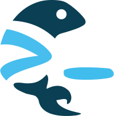

<h1 align=center>Zebrafish</h1>

<div align="center">
 
</div>
<p align="center">
  An immutable OCI container runtime operating system.
</p>

---

## Overview

Zebrafish is a modern, security-focused, and containerized operating system designed for reliability and performance. It leverages cutting-edge technologies to provide a robust platform for running containerized applications.

Zebrafish is designed to be lightweight, shipping only the necessary libraries and tools to run containerized workloads. This reduces the attack surface and improves security.

### Containerization

- **containerd:** Zebrafish uses `containerd` as its container runtime, providing a stable and efficient environment for running OCI-compliant containers.
- **ocitool**: The OS includes `ocitool`, a tool for managing OCI container images, making it easy to work with images.

### Data Integrity and Recovery

- **ZFS File System:** Zebrafish is built on top of the ZFS file system, which provides strong data integrity and protection against data corruption.
- **Disaster Recovery:** The OS includes a built-in mechanism to automatically sync all data with a remote server. This ensures that your data is always backed up and can be easily recovered in case of a disaster.

### Security First

- **Immutable:** The core operating system is immutable, meaning that it cannot be modified at runtime. This ensures that the system is always in a known good state.
- **Port Knocking:** Zebrafish supports port knocking, a technique used to hide network ports from unauthorized users. This adds an extra layer of security to your applications.
- **DNS over HTTPS (DoH):** All DNS queries are encrypted and sent over HTTPS, preventing eavesdropping and man-in-the-middle attacks.
- **HTTP/3:** Zebrafish uses HTTP/3 by default, providing a faster and more secure web experience.

### Configuration Management

- **Centralized Updates:** All updates can be tested centrally before being deployed to production, ensuring that your systems are always up-to-date and secure.
- **Overlay File System:** Configuration changes can be made through an overlay file system, which stores only the modified files. This makes it easy to manage and track changes to the system.

## Getting Started

To get started with Zebrafish, you can either build the OS from source or download the latest version.

## Getting Started with Building Zebrafish

The following steps will guide you through the build process:

1. **Clone the repository:**

   ```bash
   git clone https://github.com/darktohka/zebrafish.git
   ```

2. **Clone the Buildroot repository:**

   ```bash
   git clone https://github.com/buildroot/buildroot.git
   ```

3. **Patch Buildroot:**

   ```bash
   ./zebrafish/scripts/patch.sh buildroot zebrafish
   ```

4. **Configure the build:**

   ```bash
   ./zebrafish/scripts/config.sh buildroot zebrafish aarch64
   ```

5. **Build the OS:**
   ```bash
   ./zebrafish/scripts/build.sh buildroot zebrafish
   ```

## Getting Started with Downloading Zebrafish

If you prefer to download a pre-built version of Zebrafish, you can find the latest releases on the CDN:

1. **Download the latest release:**

   ```bash
   wget https://cdn.zebrafish.tohka.us/zebrafish-aarch64.tar
   # or
   wget https://cdn.zebrafish.tohka.us/zebrafish-x64.tar
   ```

2. **Extract the tarball:**
   ```bash
   tar -xf zebrafish-aarch64.tar
   # or
   tar -xf zebrafish-x64.tar
   ```

## Getting Started with Running Zebrafish

1. **Create test directory:**

   ```bash
   mkdir -p test
   ```

2. **Copy the initrd and kernel**

   ```bash
   cp zebrafish-initrd test/zebrafish-initrd
   cp zebrafish-kernel test/zebrafish-kernel
   ```

3. **Install ovmf_aarch64.fd or ovmf_x64.fd:**

- `ovmf_aarch64.fd` can be found at: [Debian Package List](https://packages.debian.org/sid/all/qemu-efi-aarch64/download)

4. **Run the OS:**

   ```bash
   if [[ $(uname -s) == "Linux" ]]; then
     accel="-accel kvm"
   else
     accel="-accel whpx,kernel-irqchip=off"
   fi

   if file zebrafish-kernel | grep ARM64; then
     target=qemu-system-aarch64
     accel="-cpu neoverse-n1 -machine virt"
     bios="ovmf_aarch64.fd"
   else
     target=qemu-system-x86_64
     bios="ovmf_x64.fd"
   fi

   "$target" $accel \
   -drive file=disk.img -m 2G \
   -device virtio-rng-pci \
   -net nic,model=virtio \
   -net user,hostfwd=tcp::10022-:22,hostfwd=tcp::10080-:80 \
   -kernel zebrafish-kernel -initrd zebrafish-initrd \
   -display gtk \
   -device virtio-gpu-pci \
   -append "console=tty0 ipv4=10.0.2.15 ipv4gateway=10.0.2.2" \
   -device virtio-keyboard-pci \
   -bios "$bios"
   ```

## Contributing

Contributions are welcome! If you would like to contribute to Zebrafish, please fork the repository and submit a pull request.

## License

Zebrafish is licensed under the MIT License. See the `LICENSE` file for more information.

```

```
